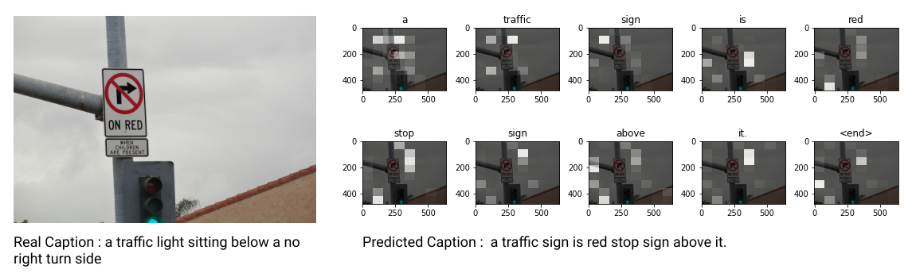
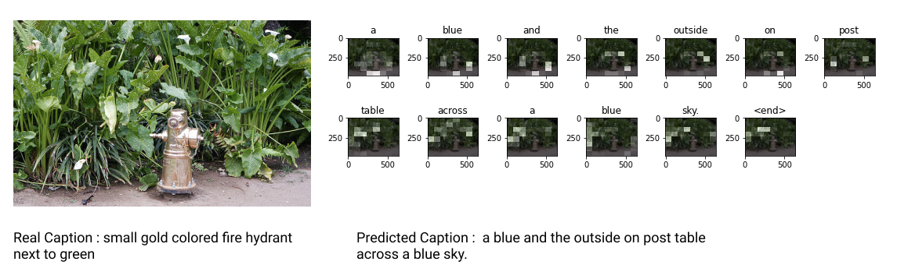
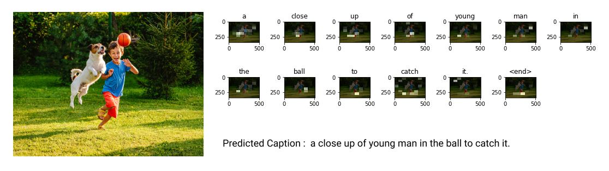
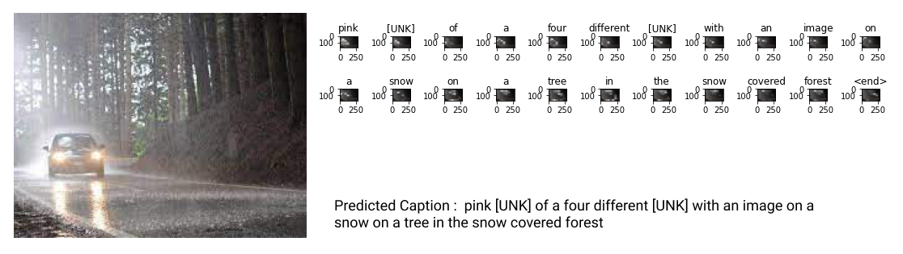

# Image Captioning Using RNN and CNN

## Introduction
Attention mechanisms are broadly used in present image captioning encoder / decoder frameworks, where at each step a weighted average is generated on encoded vectors to direct the process of caption decoding. However, the decoder has no knowledge of whether or how well the vector being attended and the attention question being given are related, which may result in the decoder providing erroneous results. Image captioning, that is to say generating natural automatic descriptions of language images are useful for visually impaired images and for the quest of natural language related pictures. It is significantly more demanding than traditional vision tasks recognition of objects and classification of images for two guidelines. First, well formed structured output space natural language sentences are considerably more challenging than just a set of class labels to predict. Secondly, this dynamic output space enables a more thin understanding of the visual scenario, and therefore also a more informative one visual scene analysis to do well on this task.

## Dataset
You will use the [MS-COCO](https://cocodataset.org/#home) dataset to train our model. The dataset contains over 82,000 images, each of which has at least 5 different caption annotations. 

To download the COCO dataset from the server, run the following script:
```
python3 data/download_data.py
```

## Dependencies
- Python 3
- Tensorflow 2.0
- Pillow
- tqdm
- nltk
  
## Model
The neural network model implemented here is based on the [Show, attend and tell paper](https://arxiv.org/abs/1502.03044) by Bengio et. al (2015).

- We extract the features from the lower convolutional layer of **InceptionV3** giving us a vector of shape (8, 8, 2048).
- Then we squash that to a shape of (64, 2048).
- This vector is then passed through the CNN Encoder (which consists of a single Fully connected layer).
- The RNN Decoder attends over the image to predict the next word.

## Training the model

The general procedure for data processing and training is as follows:

- Download COCO 2014 images and annotations. 
- Preprocess images using an **InceptionV3** neural network with ImageNet pre-trained weights. Extract features from the last convolutional layer of the CNN network.
- Tokenize captions (by space)
- Limit vocabulary size to 20000 words (can be modified)
- Create word-to-index and index-to-word mappings to embed caption vectors
- Pad sequences to be the same size (to the longest one)
- Take the features from InceptionV3 and input them into a CNN encoder (which is a single fully connected layer)
- Pass into decoder: **encoder output**, **hidden state** (initially zero), **decoder input** (start token) 
- Decoder returns prediction and decoder (hidden) state
- Use predictions and compare with real captions to compute loss
- Use **teacher forcing** to decide next input word to decoder (feed words in order while training a.k.a pass target word as the next input in decoder)
- Calculate gradients, apply optimizer and backpropagate

## Caption generation

- Once trained, the procedure for caption generation is very similar to training 
- Input image feature into CNN encoder
- Don't use teacher forcing, the inputs to the decoder at each time are the previous predictions
- Stop prediction when reaching \<end> token
- Store **attention weights** at every time step

## Demos
### On Seen Data ->


### On Un-Seen Data ->



